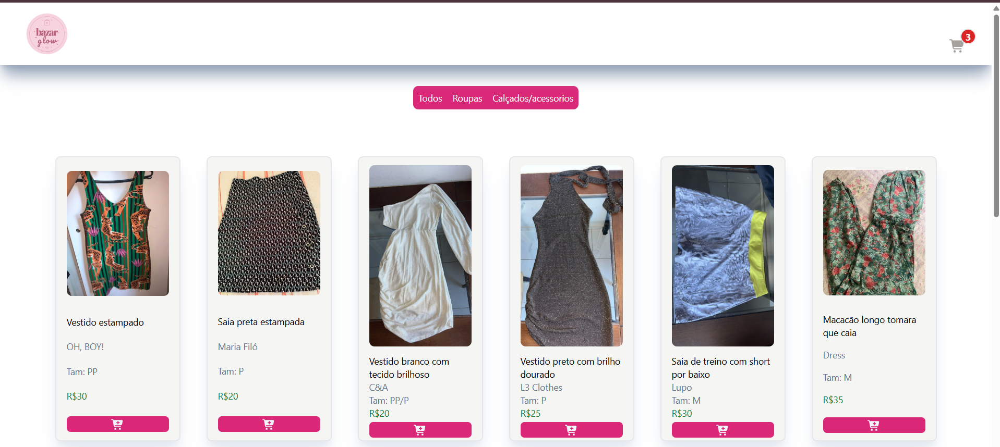
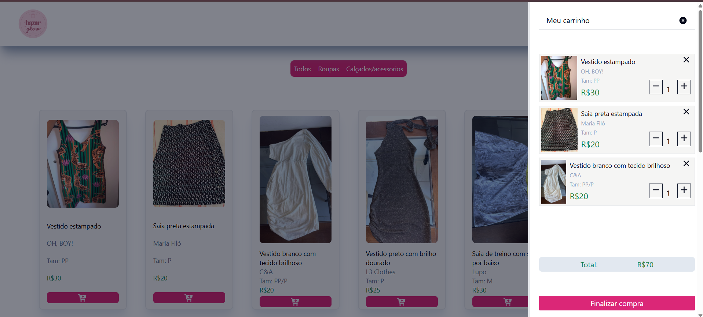
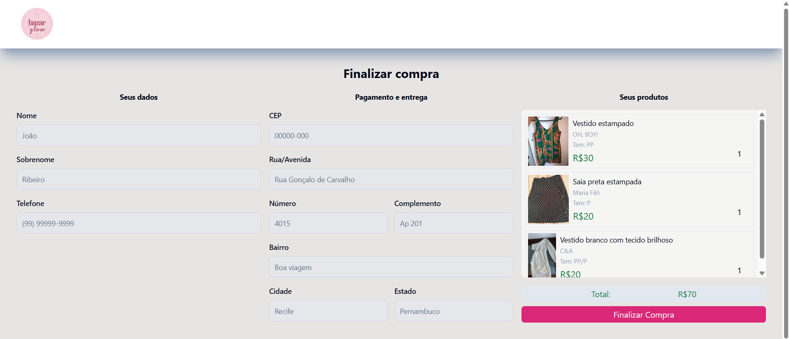

# 🛍️ Bazar Glow

Catálogo online de um bazar de roupas que vende pelo Instagram. As clientes veem todas as peças disponíveis em um só lugar, montam o carrinho e finalizam o pedido direto no WhatsApp da loja, com endereço, peças escolhidas e valor total já preenchidos.

🔗 **Site no ar:** https://bazar-glow.vercel.app

## 📸 Screenshots

### Catálogo


### Carrinho


### Checkout


---

## 📸 Tela mobile


---

## 💡 Por que este projeto existe

Este projeto nasceu de uma necessidade real. Minha namorada tem um bazar de roupas no Instagram e, até então, as clientes só descobriam o que estava disponível acompanhando stories e posts. Isso trazia dois problemas:

1. **Falta de visibilidade:** quem chegava depois não sabia quais peças ainda estavam à venda e precisava esperar uma nova publicação.
2. **Atendimento lento:** cada venda exigia uma conversa longa para coletar peças, endereço, telefone e calcular o total.

O site resolve os dois:

- **Catálogo sempre atualizado:** todas as peças disponíveis ficam em um único link (colocado na bio do Instagram), com foto, marca, tamanho e preço.
- **Pedido pronto em um clique:** a cliente escolhe as peças, preenche os dados e é redirecionada ao WhatsApp da loja com uma mensagem formatada contendo dados de entrega, lista de peças e valor total. Resta apenas combinar a entrega.

---

## ✨ Funcionalidades

- **Catálogo de produtos** com foto, nome, marca, tamanho e preço.
- **Filtros por categoria:** Todos, Roupas e Calçados/Acessórios (o filtro fica na URL via query string, então o link filtrado pode ser compartilhado).
- **Galeria de fotos (lightbox):** ao clicar na foto de uma peça, ela expande no centro da tela com botões de anterior/próxima e fechar. Também fecha ao tocar fora da imagem ou com a tecla `Esc`, e no celular é possível arrastar o dedo para trocar de foto. Disponível apenas na página inicial.
- **Carrinho lateral** com lista de peças, quantidade e total, que abre em tela cheia no celular.
- **Página de checkout** com formulário de dados pessoais e de entrega, resumo do pedido e valor total.
- **Finalização via WhatsApp:** gera uma mensagem formatada e abre a conversa com a loja já preenchida.
- **Layout responsivo**, pensado mobile-first, já que a maior parte do público acessa pelo Instagram no celular.
- **Deploy contínuo:** cada `git push` na branch `main` publica a nova versão automaticamente.

### Exemplo da mensagem enviada ao WhatsApp

```
Maria Silva - (81) 90000-0000
CEP: 00000-000
Rua/Avenida: Rua Exemplo
Número: 100
Ap: 101
Bairro: Centro
Cidade: Recife
Estado: PE

CARRINHO 🛒

➡️ Casaco com Botões - R$75
➡️ Colete Comprido com Cinto - R$88

VALOR TOTAL: R$163
```

---

## 🧰 Tecnologias

| Tecnologia | Uso |
|---|---|
| [React](https://react.dev/) | Interface em componentes |
| [Vite](https://vitejs.dev/) | Servidor de desenvolvimento e build |
| [Tailwind CSS 3](https://tailwindcss.com/) | Estilização e responsividade |
| [React Router](https://reactrouter.com/) | Navegação entre páginas |
| [Font Awesome](https://fontawesome.com/) | Ícones |
| Context API | Estado global do carrinho |
| [Vercel](https://vercel.com/) | Hospedagem e deploy contínuo |

---

## 🗂️ Estrutura do projeto

```
magazineR/
├── public/
├── src/
│   ├── assets/
│   │   ├── img/                   # fotos dos produtos
│   │   └── logo/                  # logo e imagens da marca
│   ├── components/
│   │   ├── Cart/
│   │   │   ├── CartOverlay.jsx    # carrinho lateral
│   │   │   ├── CartProducts.jsx   # lista de itens do carrinho
│   │   │   ├── cartItem.jsx       # item do carrinho (home)
│   │   │   ├── SimpleCartItem.jsx # item resumido (checkout)
│   │   │   └── TotalPriceCell.jsx # total do pedido
│   │   ├── header.jsx
│   │   └── UserButtons.jsx        # botões de carrinho e usuário
│   ├── Contexts/
│   │   └── CartContext.js         # estado e funções do carrinho
│   ├── Pages/
│   │   ├── HomePage/
│   │   │   ├── Home.jsx
│   │   │   ├── HomeMain.jsx
│   │   │   ├── ProductFilter.jsx
│   │   │   ├── ProductsContainer.jsx
│   │   │   ├── ProductCard.jsx
│   │   │   └── ImageLightbox.jsx  # galeria de fotos ampliadas
│   │   ├── CheckoutPage/
│   │      ├── Checkout.jsx
│   │      └── WppRedirect.jsx    # monta o link do WhatsApp
│   │   
│   ├── utilitarios/
│   │   ├── catalog.js             # catálogo de produtos
│   │   └── FormInput.jsx          # campo de formulário reutilizável
│   ├── App.jsx                    # rotas e provider do carrinho
│   ├── main.jsx
│   └── index.css
├── index.html
├── tailwind.config.js
├── postcss.config.js
├── vite.config.js
└── vercel.json                    # reescrita de rotas para o React Router
```

---

## 🚀 Como rodar localmente

**Pré-requisitos:** [Node.js](https://nodejs.org/) (versão LTS) e Git.

```bash
# 1. Clone o repositório
git clone https://github.com/ViniciusCavalcanti-03/bazar-glow.git

# 2. Entre na pasta do projeto
cd bazar-glow

# 3. Instale as dependências
npm install

# 4. Inicie o servidor de desenvolvimento
npm run dev
```

O site abre em `http://localhost:5173`.

Para gerar a versão de produção:

```bash
npm run build
npm run preview
```

---

## 🛒 Como atualizar o catálogo

Todos os produtos ficam em `src/utilitarios/catalog.js`.

1. Coloque a foto em `src/assets/img/` (nome simples, sem espaços ou acentos; de preferência comprimida).
2. Importe a imagem e adicione o produto à lista:

```js
import vestidoFoto from '../assets/img/product-10.jpg'
import vestidoReal from '../assets/img/product-10-real.jpg'

{
  id: 10,
  brand: 'Farm',
  name: 'Vestido Onça',
  size: 'Tam: M',
  price: 90,
  image: vestidoFoto,                   // foto exibida no card
  images: [vestidoFoto, vestidoReal],   // (opcional) fotos da galeria
  extra: false,                         // true = Calçados/Acessórios
}
```

3. Publique:

```bash
git add .
git commit -m "Atualiza catálogo"
git push
```

A Vercel republica o site automaticamente em cerca de 1 minuto.

> ⚠️ Os nomes dos arquivos nos `import` precisam bater exatamente, incluindo maiúsculas e minúsculas. O Windows ignora a diferença, mas o servidor de produção (Linux) não.

---

## ⚙️ Configuração

### Número do WhatsApp da loja

O número fica em `src/Pages/CheckoutPage/WppRedirect.jsx`, no formato internacional, sem `+`, espaços ou traços (`55` + DDD sem zero + número):

```js
const WHATSAPP_NUMBER = "5581900000000"
```

### Rotas no deploy

Como o projeto é uma SPA com React Router, o `vercel.json` redireciona todas as rotas para o `index.html`, evitando erro 404 ao abrir ou atualizar páginas como `/checkout`:

```json
{
  "rewrites": [{ "source": "/(.*)", "destination": "/index.html" }]
}
```

---

## 🌐 Deploy

O site é hospedado gratuitamente na **Vercel**, conectada a este repositório:

1. O código é enviado ao GitHub (`git push`).
2. A Vercel detecta o push na branch `main`, executa o build do Vite e publica a nova versão.
3. Se o build falhar, a versão anterior continua no ar.

---

## 📈 Possíveis melhorias futuras

- Controle de estoque, marcando peças vendidas como indisponíveis.
- Busca por nome de peça e filtro por tamanho.
- Painel simples para cadastrar produtos sem editar o código.
- Cálculo de frete por CEP.

---

## 📚 Aprendizados

Este projeto foi desenvolvido e adaptado para uma necessidade real, com identidade visual própria, galeria de fotos, integração com WhatsApp, layout mobile e deploy em produção. Pelo caminho, pratiquei:

- Componentização e estado global com Context API
- Roteamento com React Router e filtros via query string
- Estilização responsiva com Tailwind (mobile-first)
- Manipulação de formulários e montagem de mensagens dinâmicas
- Fluxo completo de Git/GitHub e deploy contínuo

---

## 👨‍💻 Autor

**Vinicius Cavalcanti**

GitHub: [@ViniciusCavalcanti-03](https://github.com/ViniciusCavalcanti-03)

Linkedin:[@vinicius-cavalcanti-si](https://www.linkedin.com/in/vinicius-cavalcanti-si/?isSelfProfile=true) 

Desenvolvido com carinho para o Bazar Glow 💗
